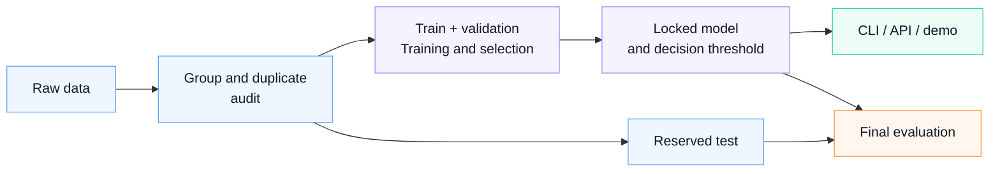

# Pneumonia X-Ray CNN

[](pyproject.toml)
[](https://pytorch.org/)
[](LICENSE)

A research project that classifies chest X-rays as `NORMAL` or `PNEUMONIA`.
It combines data auditing, model training, and external evaluation with
single-image prediction, a FastAPI service, and a Streamlit demo.
**This is not a medical diagnostic tool.**

## Workflow



The model and threshold are selected on validation data; the test is reserved
for the final evaluation.

JPEG/JPG/PNG inputs produce a class label and model probabilities.
[Command-line prediction](#4-predict-a-single-image) returns JSON;
the [web demo](#5-api-and-demo) supports image upload and result display.

## Model and results

The main model is **ResNet18 initialized with ImageNet weights**, using
**224 × 224 inputs, CLAHE**, and a decision threshold of **0.88200253**.
Results on the historical 624-image Kermany test set:

| Metric | Value |
|---|---:|
| Accuracy | 89.58% |
| Precision | 86.03% |
| Recall | 99.49% |
| F1 | 92.27% |
| ROC-AUC | 97.92% |

False positives: **63**; false negatives: **2**.
This test set was observed in earlier experiments; these results are not
independent clinical validation. Generalization across data sources is limited;
[external evaluation results](#experiments-and-development) are reported separately.

- [Short results report and limitations](docs/project_report.md)
- [Detailed results and confidence intervals](docs/clean_v3_matched98_results.md)
- [Experiment and dataset research index](docs/README.md)
- [Fresh installation verification](docs/reproduction_check.md)

**The repository contains code and reports, without datasets or trained checkpoints.**
The current local model is at `models/clean_v3/selected_matched98/best_model.pt`.
For a fresh clone, follow the workflow below to train your own checkpoint.
Retraining does not guarantee the historical model's hash or identical metrics.

## 1. Installation

Run the commands from the repository root. A fresh installation was verified on
Windows / Python 3.12.10. The package requires Python ≥3.10; other platforms
and versions have not been separately verified.

```powershell
python -m venv .venv
.\.venv\Scripts\Activate.ps1
python -m pip install -e ".[dev]"
```

On Linux/macOS, activate with `source .venv/bin/activate`.
A GPU is optional; training uses a GPU when CUDA is available, otherwise the CPU.
PyTorch packages and datasets can be large. Before the first installation or
training run, check downloads in the [data and weights guide](docs/data_and_weights.md).

## 2. Acquire and prepare the data

The main workflow uses Kermany's **Chest X-Ray Images (Pneumonia)** dataset.
Download sources, versions, and attribution are in the [data guide](docs/data_and_weights.md).
Extract only the `chest_xray` directory into this structure:

```text
data/raw/chest_xray/
├── train/{NORMAL,PNEUMONIA}/
├── val/{NORMAL,PNEUMONIA}/
└── test/{NORMAL,PNEUMONIA}/
```

```powershell
python scripts/check_dataset_ready.py
python -m src.data.standardize_dataset --config configs/config.yaml
```

The default group-audited preparation creates train/val/test manifests,
excluded records, and `split_audit.json` under `data/processed/clean_v1`.
The reference data retains **3,802 training / 951 validation / 624 test** images;
479 development images are excluded, while raw files are preserved.
Keep the original filenames: they are used to infer patient groups.
Prepare the data once and reuse the audited manifests for later experiments.

## 3. Train and select on validation data

Use a fresh output directory for each experiment:

```powershell
python -m src.training.train_clean --manifests data/processed/clean_v1 --model resnet18 --preprocessing clahe --cache-images --epochs 16 --lr 0.0005 --patience 5 --minimum-recall 0.98 --output models/clean_runs/resnet18_clahe
python -m src.evaluation.evaluate_clean select --experiments models/clean_runs/resnet18_clahe --manifests data/processed/clean_v1 --minimum-recall 0.98 --output models/clean_runs/selected
```

Training verifies train/val source hashes and does not read the test manifest
or images. The checkpoint is selected by validation loss; the decision
threshold maximizes specificity, then F1, subject to validation recall ≥98%.
This condition does not guarantee 98% recall on new data.
The protocol, training history, and selection record are saved.

After locking the selection, evaluate the test in a separate command:

```powershell
python -m src.evaluation.evaluate_clean test --manifests data/processed/clean_v1 --output models/clean_runs/selected
```

The selected directory contains `selection.json`, `best_model.pt`,
`test_metrics.json`, and `test_predictions.npz`. An existing test report cannot
be overwritten. A new output directory does not make an observed test independent
again; do not tune the threshold or model based on its scores.

## 4. Predict a single image

```powershell
python scripts/predict_image.py --model models/clean_runs/selected/best_model.pt --image data/raw/chest_xray/test/NORMAL/IM-0003-0001.jpeg
```

JPEG/JPG/PNG are supported. The JSON response contains the class label, both
model probabilities, `confidence`, and model version. Input size, normalization,
CLAHE, and threshold are read from the checkpoint. These probabilities are
not calibrated clinical risk estimates.

Without `--model`, the historical local checkpoint in `configs/config.yaml`
is used; this file is absent from a fresh clone. Specify your checkpoint path explicitly.

## 5. API and demo

In PowerShell, select your trained model and start the API:

```powershell
$env:PNEUMONIA_MODEL_PATH = "models/clean_runs/selected/best_model.pt"
python -m uvicorn app.api.main:app --host 127.0.0.1 --port 8000
```

Equivalent command in a POSIX shell:

```bash
PNEUMONIA_MODEL_PATH=models/clean_runs/selected/best_model.pt python -m uvicorn app.api.main:app --host 127.0.0.1 --port 8000
```

API documentation: `http://127.0.0.1:8000/docs`. Endpoints: `GET /health`,
`GET /model-info`, and `POST /predict` (multipart `file`). `/model-info` shows
the active threshold and preprocessing.

In a separate terminal, activate the same virtual environment and run the demo:

```powershell
python -m streamlit run app/ui/streamlit_app.py
```

The demo uses `http://127.0.0.1:8000` by default. Set the `PNEUMONIA_API_URL`
environment variable for another address. `.env.example` documents the variables;
the application does not automatically load `.env` files.

## Data preparation, evaluation, and limitations

- **Group and duplicate audit:** Filename-derived patient groups, file/pixel
  hashes, and detected near duplicates are assigned together. Audited train/val/test
  intersections are zero. Filenames are not verified patient identities, so
  the project does not claim absolute freedom from leakage.
- **Validation selection:** Training uses only train/val manifests;
  the model and decision threshold are saved before test evaluation.
- **Test history:** The Kermany test was observed in earlier experiments.
  Repeated evaluations do not replace an independent final test.
- **Source shift:** Reliability has not been established across hospitals,
  age distributions, or label definitions. Model probabilities are not clinical risk.

Method and audit details are in the [short report](docs/project_report.md)
and [training protocol](docs/clean_training_protocol.md).

## Experiments and development

The selected model after data auditing and retraining is compared below with
the original model on the same historical 624-image test. The original model
uses its recorded **0.70** threshold; the current model uses its validation threshold.

| Metric | Original model | Current model |
|---|---:|---:|
| Accuracy | 88.30% | 89.58% |
| Precision | 84.68% | 86.03% |
| Recall | 99.23% | 99.49% |
| F1 | 91.38% | 92.27% |
| ROC-AUC | 95.99% | 97.92% |

False positives **70 → 63**, false negatives **3 → 2**. The improvement is modest;
this comparison is not independent external validation.


Additional experiments with NIH data, MIMIC-pretrained features, and RSNA
opacity data did not produce a strong improvement suitable for replacing the
main model. A separate SSMU model achieved **86.36% F1** on its own test, but
only **2.82% F1** with **1,505 false positives** on the external OpenI check.
Patient identities and clinical labels are unverified; this candidate did not
replace the main model. Scores from different source test sets are not directly comparable.

- [Main comparison and confidence intervals](docs/clean_v3_matched98_results.md)
- [Record of successful and unsuccessful experiments](docs/experiment_ledger.md)
- [SSMU model and OpenI results](docs/ssmu_model_results.md)
- [All protocols and dataset research](docs/README.md)

## Development and repository layout

```powershell
python -m ruff check .
python -m pytest
```

With Make available, the equivalent main workflow is `make prepare`, `make train`,
`make select`, and `make evaluate`. Change `RUN_DIR` and `SELECTED_DIR` for new
experiments. `make evaluate-legacy` is the historical plotting/reporting tool
using the model in config; the main selection workflow is documented above.

| Location | Purpose |
|---|---|
| `src/data/`, `src/training/`, `src/evaluation/` | Preparation, training, threshold/model selection |
| `src/inference/`, `app/api/`, `app/ui/` | Checkpoint inference and demo |
| `configs/config.yaml` | Data and default prediction paths; main training parameters are CLI options |
| `docs/` | Current report, acquisition guide, and historical experiment index |
| `tests/` | Group/duplicate separation, threshold selection, training, and inference checks |
| `data/`, `models/`, `reports/` | Local data and outputs, excluded from Git |

## License and attribution

Project code is licensed under [MIT](LICENSE). Datasets, third-party pretrained
weights, and derived checkpoints have separate terms; the repository license
does not relicense them under MIT. Sources and citations are in the
[data and weights guide](docs/data_and_weights.md).
