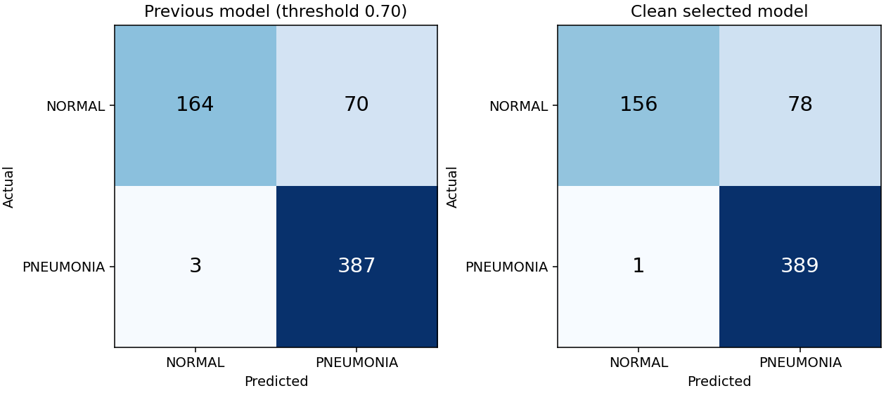

# Clean retraining: measured model comparison

## Locked selection

- Selected experiment: `resnet18_unweighted`
- Candidate checkpoint (not automatically deployed): `models/clean_v1/selected/best_model.pt`
- Checkpoint SHA-256: `c39e9a9104cb7d10b0408502a4197ddb1abecc53299aa98cb9077a015bc30be2`
- Operating threshold: `0.29853299`
- Selection used validation specificity at recall >=99%; F1 breaks ties.
- The threshold was fixed before evaluating the selected model on the legacy test.
- Validation operating point: recall 99.12%,
  specificity 97.78%, F1 99.12%.

## Same 624-image legacy test

The previous model uses its deployed 0.70 threshold. New metrics use the new
validation-selected threshold. Neither threshold is optimized on these test labels.
Changes are percentage points; intervals are 95% patient-proxy cluster bootstrap
intervals (1,000 resamples), not evidence of clinical reliability.

| Metric | Previous | Clean selected | Change (pp) | New 95% interval |
|---|---:|---:|---:|---:|
| Accuracy | 88.30% | 87.34% | -0.96 | 84.19%–90.14% |
| Precision | 84.68% | 83.30% | -1.39 | 79.08%–87.28% |
| Recall | 99.23% | 99.74% | +0.51 | 99.15%–100.00% |
| Specificity | 70.09% | 66.67% | -3.42 | 60.26%–73.00% |
| F1 | 91.38% | 90.78% | -0.60 | 88.21%–93.11% |
| ROC-AUC | 95.99% | 96.82% | +0.82 | 95.37%–98.00% |

- False positives: **70 → 78**.
- False negatives: **3 → 1**.

## Validation comparison used for selection

These validation results must not be compared directly with the test results above.

| Experiment | Accuracy | Precision | Recall | F1 | Specificity |
|---|---:|---:|---:|---:|---:|
| resnet18_unweighted | 98.74% | 99.12% | 99.12% | 99.12% | 97.78% |
| efficientnet_b0_unweighted | 97.69% | 97.68% | 99.12% | 98.40% | 94.07% |

## Leakage controls and limits

- Train: 3802 images; validation: 951;
  unchanged original test: 624.
- Excluded development images: 479; raw files retained.
- No shared filename-derived patient groups, byte hashes, decoded pixel hashes,
  or connected duplicate groups between any pair of splits.
- Detected cross-split near-duplicate pairs: 0.
- Identities are conservative filename proxies. Actual patient-disjointness cannot
  be established beyond the supplied metadata. Similarity screening is not exhaustive.
- The legacy test was inspected by older project versions. This is a same-dataset
  benchmark comparison, not untouched external validation or clinical validation.
- Validation threshold selection has its own estimation uncertainty; the 99% recall
  target does not guarantee 99% recall on a new population.

## Reproducibility

See [the experiment protocol](clean_training_protocol.md). Full audit, excluded
manifest and original source hashes are in `data/processed/clean_v1`. Each experiment
contains its configuration, training history, validation predictions, and checkpoint.
The selected directory contains the locked selection, test predictions, bootstrap
intervals, and the machine-readable comparison. Previous artifacts are retained.

Educational/research model; not a medical diagnostic device.
