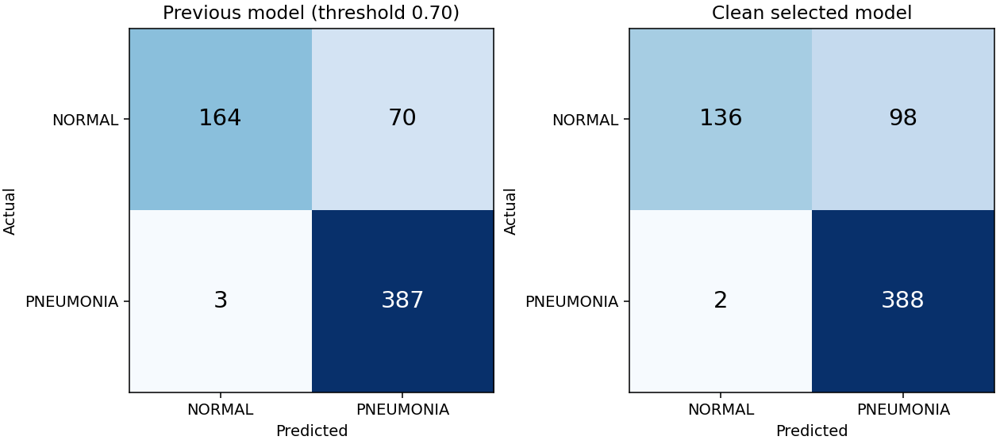

# Clean retraining: measured model comparison

## Locked selection

- Selected experiment: `c0p01`
- Candidate checkpoint (not automatically deployed): `models/clean_v2/selected/best_model.pt`
- Checkpoint SHA-256: `52761b32e87517daec4aaec5321476a24d183d7af1f45c79657267b30401321e`
- Operating threshold: `0.39080343`
- Selection used validation specificity at recall >=99%; F1 breaks ties.
- The threshold was fixed before evaluating the selected model on the legacy test.
- Validation operating point: recall 99.12%,
  specificity 94.07%, F1 98.40%.

## Same 624-image legacy test

The previous model uses its deployed 0.70 threshold. New metrics use the new
validation-selected threshold. Neither threshold is optimized on these test labels.
Changes are percentage points; intervals are 95% patient-proxy cluster bootstrap
intervals (1,000 resamples), not evidence of clinical reliability.

| Metric | Previous | Clean selected | Change (pp) | New 95% interval |
|---|---:|---:|---:|---:|
| Accuracy | 88.30% | 83.97% | -4.33 | 80.51%–87.12% |
| Precision | 84.68% | 79.84% | -4.85 | 75.29%–83.78% |
| Recall | 99.23% | 99.49% | +0.26 | 98.65%–100.00% |
| Specificity | 70.09% | 58.12% | -11.97 | 51.53%–64.53% |
| F1 | 91.38% | 88.58% | -2.80 | 85.62%–90.99% |
| ROC-AUC | 95.99% | 96.99% | +0.99 | 95.73%–98.07% |

- False positives: **70 → 98**.
- False negatives: **3 → 2**.

## Validation comparison used for selection

These validation results must not be compared directly with the test results above.

| Experiment | Accuracy | Precision | Recall | F1 | Specificity |
|---|---:|---:|---:|---:|---:|
| c0p01 | 97.69% | 97.68% | 99.12% | 98.40% | 94.07% |
| c0p1 | 96.85% | 96.57% | 99.12% | 97.83% | 91.11% |
| c1p0 | 96.85% | 96.57% | 99.12% | 97.83% | 91.11% |
| c10p0 | 97.06% | 96.84% | 99.12% | 97.97% | 91.85% |

## Leakage controls and limits

- Train: 3802 images; validation: 951;
  unchanged original test: 624.
- Excluded development images: 479; raw files retained.
- No shared filename-derived patient groups, byte hashes, decoded pixel hashes,
  or connected duplicate groups between any pair of splits.
- Detected cross-split near-duplicate pairs: 0.
- Identities are conservative filename proxies. Actual patient-disjointness cannot
  be established beyond the supplied metadata. Similarity screening is not exhaustive.
- The legacy test was inspected by older project versions. This is a same-dataset
  benchmark comparison, not untouched external validation or clinical validation.
- Validation threshold selection has its own estimation uncertainty; the 99% recall
  target does not guarantee 99% recall on a new population.

## Reproducibility

See [the experiment protocol](clean_training_protocol.md). Full audit, excluded
manifest and original source hashes are in `data/processed/clean_v1`. Each experiment
contains its configuration, training history, validation predictions, and checkpoint.
The selected directory contains the locked selection, test predictions, bootstrap
intervals, and the machine-readable comparison. Previous artifacts are retained.

Educational/research model; not a medical diagnostic device.
