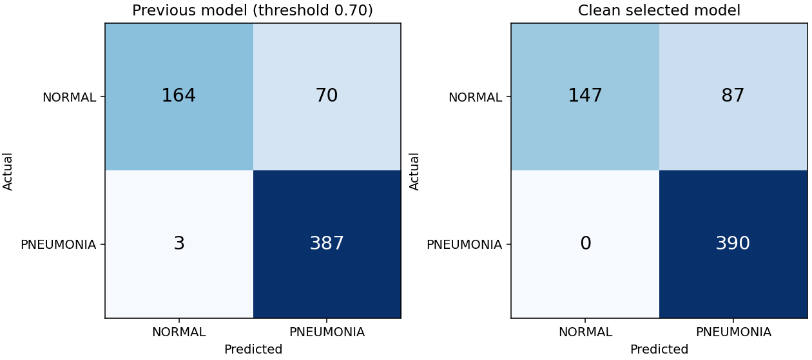

# Clean retraining: measured model comparison

## Locked selection

- Selected experiment: `resnet18_clahe`
- Candidate checkpoint (not automatically deployed): `models/clean_v3/selected/best_model.pt`
- Checkpoint SHA-256: `0c6d678c2c8e01be26aca3fee3352946d9974308d3734097f1ece2920b87f113`
- Operating threshold: `0.29321870`
- Selection used validation specificity at recall >=99%; F1 breaks ties.
- The previous deployed model's documented validation recall floor was 98%.
- The threshold was fixed before evaluating the selected model on the legacy test.
- Validation operating point: recall 99.27%,
  specificity 95.56%, F1 98.76%.

## Same 624-image legacy test

The previous model uses its deployed 0.70 threshold. New metrics use the new
validation-selected threshold. Neither threshold is optimized on these test labels.
Changes are percentage points; intervals are 95% patient-proxy cluster bootstrap
intervals (1,000 resamples), not evidence of clinical reliability.

| Metric | Previous | Clean selected | Change (pp) | New 95% interval |
|---|---:|---:|---:|---:|
| Accuracy | 88.30% | 86.06% | -2.24 | 82.79%–89.11% |
| Precision | 84.68% | 81.76% | -2.92 | 77.37%–85.75% |
| Recall | 99.23% | 100.00% | +0.77 | 100.00%–100.00% |
| Specificity | 70.09% | 62.82% | -7.26 | 56.12%–69.16% |
| F1 | 91.38% | 89.97% | -1.42 | 87.24%–92.33% |
| ROC-AUC | 95.99% | 97.92% | +1.93 | 96.76%–98.85% |

- False positives: **70 → 87**.
- False negatives: **3 → 0**.

## Validation comparison used for selection

These validation results must not be compared directly with the test results above.

| Experiment | Accuracy | Precision | Recall | F1 | Specificity |
|---|---:|---:|---:|---:|---:|
| xrv_clahe_finetuned | 95.79% | 95.20% | 99.12% | 97.12% | 87.41% |
| resnet18_clahe | 98.21% | 98.26% | 99.27% | 98.76% | 95.56% |

## Leakage controls and limits

- Train: 3802 images; validation: 951;
  unchanged original test: 624.
- Excluded development images: 479; raw files retained.
- No shared filename-derived patient groups, byte hashes, decoded pixel hashes,
  or connected duplicate groups between any pair of splits.
- Detected cross-split near-duplicate pairs: 0.
- Identities are conservative filename proxies. Actual patient-disjointness cannot
  be established beyond the supplied metadata. Similarity screening is not exhaustive.
- The legacy test was inspected by older project versions. This is a same-dataset
  benchmark comparison, not untouched external validation or clinical validation.
- Validation threshold selection has its own estimation uncertainty; the 99% recall
  target does not guarantee the same recall on a new population.

## Reproducibility

See [the experiment protocol](clean_training_protocol.md). Full audit, excluded
manifest and original source hashes are in `data/processed/clean_v1`. Each experiment
contains its configuration, training history, validation predictions, and checkpoint.
The selected directory contains the locked selection, test predictions, bootstrap
intervals, and the machine-readable comparison. Previous artifacts are retained.

Educational/research model; not a medical diagnostic device.
