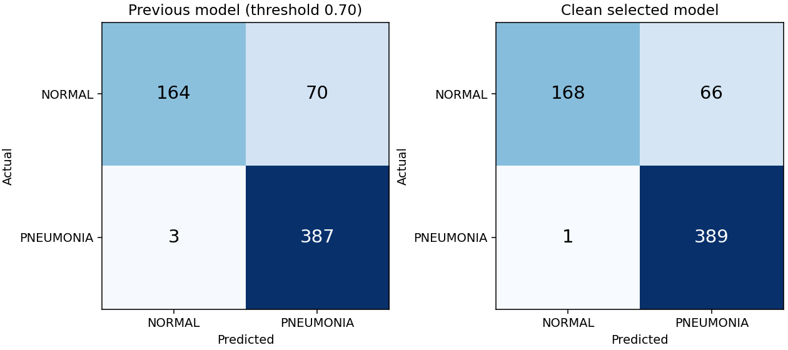

# Clean retraining: measured model comparison

## Comparison with the current clean incumbent

The fixed ensemble won validation, but did not improve the current deployed clean
ResNet18 on the legacy test. Deployment remains unchanged. The original baseline
comparison below must not be mistaken for an improvement over the incumbent.

| Metric | Current clean ResNet18 | Fixed ensemble |
|---|---:|---:|
| accuracy | 89.58% | 89.26% |
| precision | 86.03% | 85.49% |
| recall | 99.49% | 99.74% |
| specificity | 73.08% | 71.79% |
| f1 | 92.27% | 92.07% |
| roc_auc | 97.92% | 97.50% |

False positives: **63 → 66**; false negatives: **2 → 1**. The extra inference cost and lower accuracy/F1 do not establish the requested improvement. No RSNA re-evaluation was performed for this candidate.

## Locked selection

- Selected experiment: `ensemble3`
- Candidate checkpoint (not automatically deployed): `models/clean_v5/selected/best_model.pt`
- Checkpoint SHA-256: `98e9b89a21801abf53d1da6baf5dead38c84ef318008e15232fc7fcb32c341fb`
- Operating threshold: `0.67356920`
- Selection used validation specificity at recall >=98%; F1 breaks ties.
- The previous deployed model's documented validation recall floor was 98%.
- The threshold was fixed before evaluating the selected model on the legacy test.
- Validation operating point: recall 98.53%,
  specificity 99.26%, F1 99.11%.

## Same 624-image legacy test

The previous model uses its deployed 0.70 threshold. New metrics use the new
validation-selected threshold. Neither threshold is optimized on these test labels.
Changes are percentage points; intervals are 95% patient-proxy cluster bootstrap
intervals (1,000 resamples), not evidence of clinical reliability.

| Metric | Previous | Clean selected | Change (pp) | New 95% interval |
|---|---:|---:|---:|---:|
| Accuracy | 88.30% | 89.26% | +0.96 | 86.33%–91.85% |
| Precision | 84.68% | 85.49% | +0.81 | 81.47%–89.11% |
| Recall | 99.23% | 99.74% | +0.51 | 99.15%–100.00% |
| Specificity | 70.09% | 71.79% | +1.71 | 65.29%–77.49% |
| F1 | 91.38% | 92.07% | +0.69 | 89.66%–94.21% |
| ROC-AUC | 95.99% | 97.50% | +1.50 | 96.20%–98.58% |

- False positives: **70 → 66**.
- False negatives: **3 → 1**.

## Validation comparison used for selection

These validation results must not be compared directly with the test results above.

| Experiment | Accuracy | Precision | Recall | F1 | Specificity |
|---|---:|---:|---:|---:|---:|
| resnet18_clahe | 98.32% | 99.55% | 98.09% | 98.82% | 98.89% |
| ensemble3 | 98.74% | 99.70% | 98.53% | 99.11% | 99.26% |

## Leakage controls and limits

- Train: 3802 images; validation: 951;
  unchanged original test: 624.
- Excluded development images: 479; raw files retained.
- No shared filename-derived patient groups, byte hashes, decoded pixel hashes,
  or connected duplicate groups between any pair of splits.
- Detected cross-split near-duplicate pairs: 0.
- Identities are conservative filename proxies. Actual patient-disjointness cannot
  be established beyond the supplied metadata. Similarity screening is not exhaustive.
- The legacy test was inspected by older project versions. This is a same-dataset
  benchmark comparison, not untouched external validation or clinical validation.
- Validation threshold selection has its own estimation uncertainty; the 98% recall
  target does not guarantee the same recall on a new population.

## Reproducibility

See [the experiment protocol](clean_training_protocol.md). Full audit, excluded
manifest and original source hashes are in `data/processed/clean_v1`. Each experiment
contains its configuration, training history, validation predictions, and checkpoint.
The selected directory contains the locked selection, test predictions, bootstrap
intervals, and the machine-readable comparison. Previous artifacts are retained.

Educational/research model; not a medical diagnostic device.
