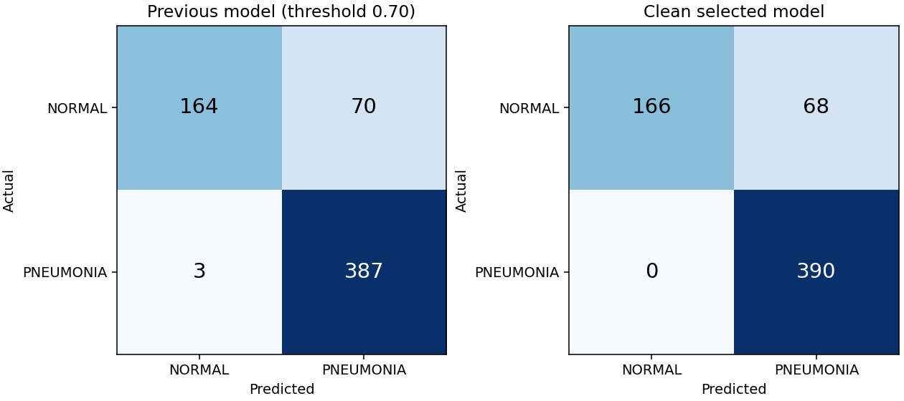

# Clean retraining: measured model comparison

## Comparison with the deployed clean incumbent

The RSNA-pretrained candidate won validation but does not improve all metrics on the legacy test. It is not deployed.

| Metric | Clean incumbent | RSNA-pretrained candidate |
|---|---:|---:|
| accuracy | 89.58% | 89.10% |
| precision | 86.03% | 85.15% |
| recall | 99.49% | 100.00% |
| specificity | 73.08% | 70.94% |
| f1 | 92.27% | 91.98% |
| roc_auc | 97.92% | 97.32% |

False negatives decrease **2 → 0**, but false positives increase **63 → 68**. Observing no false negatives in 390 cases does not establish perfect population sensitivity. A nonparametric bootstrap interval of 100–100% for recall is degenerate in this situation and must not be interpreted as certainty. The experiment does not satisfy the goal of a large improvement across all metrics.

## Locked selection

- Selected experiment: `rsna_then_pediatric`
- Candidate checkpoint (not automatically deployed): `models/clean_v6/selected/best_model.pt`
- Checkpoint SHA-256: `6800120d72d7ddc4e536c60ed4c82ef17a7a977c5f0b0382bda3238361cc04d8`
- Operating threshold: `0.84971970`
- Selection used validation specificity at recall >=98%; F1 breaks ties.
- The previous deployed model's documented validation recall floor was 98%.
- The threshold was fixed before evaluating the selected model on the legacy test.
- Validation operating point: recall 98.09%,
  specificity 99.63%, F1 98.96%.

## Same 624-image legacy test

The previous model uses its deployed 0.70 threshold. New metrics use the new
validation-selected threshold. Neither threshold is optimized on these test labels.
Changes are percentage points; intervals are 95% patient-proxy cluster bootstrap
intervals (1,000 resamples), not evidence of clinical reliability.

| Metric | Previous | Clean selected | Change (pp) | New 95% interval |
|---|---:|---:|---:|---:|
| Accuracy | 88.30% | 89.10% | +0.80 | 86.30%–91.77% |
| Precision | 84.68% | 85.15% | +0.47 | 81.29%–88.98% |
| Recall | 99.23% | 100.00% | +0.77 | 100.00%–100.00% |
| Specificity | 70.09% | 70.94% | +0.85 | 64.84%–76.71% |
| F1 | 91.38% | 91.98% | +0.60 | 89.68%–94.17% |
| ROC-AUC | 95.99% | 97.32% | +1.33 | 95.91%–98.46% |

- False positives: **70 → 68**.
- False negatives: **3 → 0**.

## Validation comparison used for selection

These validation results must not be compared directly with the test results above.

| Experiment | Accuracy | Precision | Recall | F1 | Specificity |
|---|---:|---:|---:|---:|---:|
| resnet18_clahe | 98.32% | 99.55% | 98.09% | 98.82% | 98.89% |
| rsna_then_pediatric | 98.53% | 99.85% | 98.09% | 98.96% | 99.63% |

## Leakage controls and limits

- Train: 3802 images; validation: 951;
  unchanged original test: 624.
- Excluded development images: 479; raw files retained.
- No shared filename-derived patient groups, byte hashes, decoded pixel hashes,
  or connected duplicate groups between any pair of splits.
- Detected cross-split near-duplicate pairs: 0.
- Identities are conservative filename proxies. Actual patient-disjointness cannot
  be established beyond the supplied metadata. Similarity screening is not exhaustive.
- The legacy test was inspected by older project versions. This is a same-dataset
  benchmark comparison, not untouched external validation or clinical validation.
- Validation threshold selection has its own estimation uncertainty; the 98% recall
  target does not guarantee the same recall on a new population.

## Reproducibility

See [the experiment protocol](clean_training_protocol.md). Full audit, excluded
manifest and original source hashes are in `data/processed/clean_v1`. Each experiment
contains its configuration, training history, validation predictions, and checkpoint.
The selected directory contains the locked selection, test predictions, bootstrap
intervals, and the machine-readable comparison. Previous artifacts are retained.

Educational/research model; not a medical diagnostic device.
