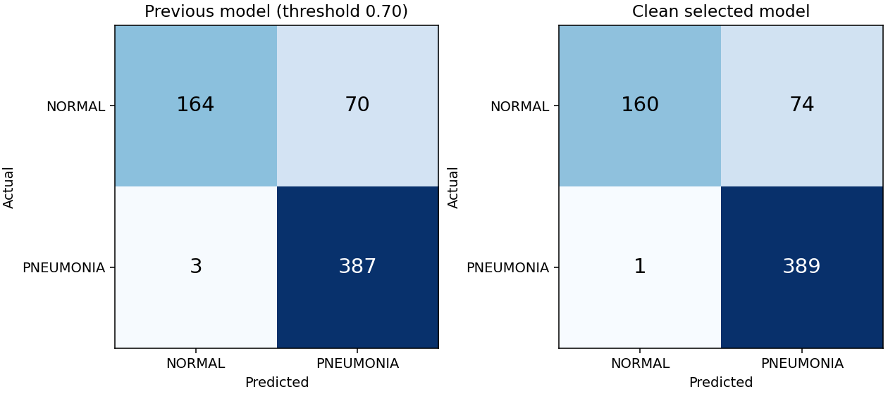

# Clean retraining: measured model comparison

## Comparison with deployed clean incumbent

The 384px candidate won validation but did not improve the legacy test. Deployment is unchanged.

| Metric | Clean 224px incumbent | 384px candidate |
|---|---:|---:|
| accuracy | 89.58% | 87.98% |
| precision | 86.03% | 84.02% |
| recall | 99.49% | 99.74% |
| specificity | 73.08% | 68.38% |
| f1 | 92.27% | 91.21% |
| roc_auc | 97.92% | 97.69% |

False positives: **63 → 74**; false negatives: **2 → 1**. Higher input resolution did not establish improved generalization.

## Locked selection

- Selected experiment: `resnet18_clahe384`
- Candidate checkpoint (not automatically deployed): `models/clean_v7/selected/best_model.pt`
- Checkpoint SHA-256: `3184fee71871bc1fb242cf86772f5af33ab76d997f05efb38f3bfe3ea08dd6c7`
- Operating threshold: `0.72188395`
- Selection used validation specificity at recall >=98%; F1 breaks ties.
- The previous deployed model's documented validation recall floor was 98%.
- The threshold was fixed before evaluating the selected model on the legacy test.
- Validation operating point: recall 98.24%,
  specificity 99.26%, F1 98.96%.

## Same 624-image legacy test

The previous model uses its deployed 0.70 threshold. New metrics use the new
validation-selected threshold. Neither threshold is optimized on these test labels.
Changes are percentage points; intervals are 95% patient-proxy cluster bootstrap
intervals (1,000 resamples), not evidence of clinical reliability.

| Metric | Previous | Clean selected | Change (pp) | New 95% interval |
|---|---:|---:|---:|---:|
| Accuracy | 88.30% | 87.98% | -0.32 | 85.12%–90.78% |
| Precision | 84.68% | 84.02% | -0.67 | 79.82%–87.89% |
| Recall | 99.23% | 99.74% | +0.51 | 99.15%–100.00% |
| Specificity | 70.09% | 68.38% | -1.71 | 62.39%–75.00% |
| F1 | 91.38% | 91.21% | -0.17 | 88.68%–93.46% |
| ROC-AUC | 95.99% | 97.69% | +1.70 | 96.55%–98.68% |

- False positives: **70 → 74**.
- False negatives: **3 → 1**.

## Validation comparison used for selection

These validation results must not be compared directly with the test results above.

| Experiment | Accuracy | Precision | Recall | F1 | Specificity |
|---|---:|---:|---:|---:|---:|
| resnet18_clahe | 98.32% | 99.55% | 98.09% | 98.82% | 98.89% |
| resnet18_clahe384 | 98.53% | 99.70% | 98.24% | 98.96% | 99.26% |

## Leakage controls and limits

- Train: 3802 images; validation: 951;
  unchanged original test: 624.
- Excluded development images: 479; raw files retained.
- No shared filename-derived patient groups, byte hashes, decoded pixel hashes,
  or connected duplicate groups between any pair of splits.
- Detected cross-split near-duplicate pairs: 0.
- Identities are conservative filename proxies. Actual patient-disjointness cannot
  be established beyond the supplied metadata. Similarity screening is not exhaustive.
- The legacy test was inspected by older project versions. This is a same-dataset
  benchmark comparison, not untouched external validation or clinical validation.
- Validation threshold selection has its own estimation uncertainty; the 98% recall
  target does not guarantee the same recall on a new population.

## Reproducibility

See [the experiment protocol](clean_training_protocol.md). Full audit, excluded
manifest and original source hashes are in `data/processed/clean_v1`. Each experiment
contains its configuration, training history, validation predictions, and checkpoint.
The selected directory contains the locked selection, test predictions, bootstrap
intervals, and the machine-readable comparison. Previous artifacts are retained.

Educational/research model; not a medical diagnostic device.
