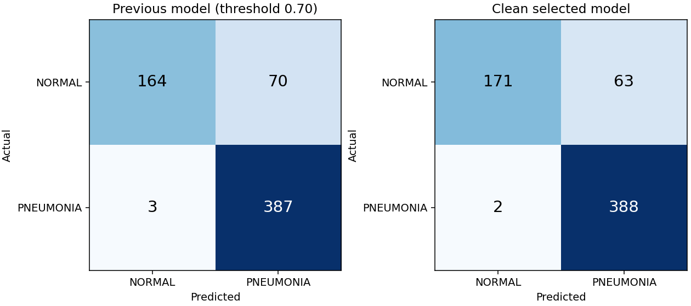

# Short project report

Updated: **October 5, 2026**. This report summarizes completed experiments;
real test sets were not rescored during publication preparation.

## Purpose and main model

The goal is a research project that classifies chest X-rays as `NORMAL` or
`PNEUMONIA`, with traceability from training to serving. The project imposes
no age restriction; the age coverage of the main Kermany dataset belongs to
that source. Reliability across ages and hospitals has not been established.

The current local model uses **ResNet18**, ImageNet initialization,
**224 × 224 CLAHE** preprocessing, and a **0.8820025324821472** decision threshold.
Training used two classifier warmup epochs followed by full-network fine-tuning,
up to 16 epochs, batch size 24, initial LR 0.0005, seed 42, and checkpoint
selection by validation loss. The final threshold maximized specificity,
then F1, subject to validation recall ≥98%.

## Measured change from the original model

The same historical 624-image test contains 390 `PNEUMONIA` and 234 `NORMAL` images.
The original model uses its recorded **0.70** threshold; the current model
uses its own validation threshold:

| Metric | Original | Current | Change (percentage points) |
|---|---:|---:|---:|
| Accuracy | 88.30% | 89.58% | +1.28 |
| Precision | 84.68% | 86.03% | +1.35 |
| Recall | 99.23% | 99.49% | +0.26 |
| F1 | 91.38% | 92.27% | +0.89 |
| ROC-AUC | 95.99% | 97.92% | +1.93 |

Current confusion matrix: TN **171**, FP **63**, FN **2**, TP **388**.
Originally, TN 164, FP 70, FN 3, TP 387. The improvement is modest;
despite high recall, 63 of 234 normal images trigger false alarms.
[Comparison and confidence intervals](clean_v3_matched98_results.md).

## Data leakage audit

- The raw train/val development data was split into **3,802 training / 951 validation**
  images; the original **624 test** images were retained. 479 development images were excluded.
- `personN` identifiers were grouped across subtypes; conservative group keys
  were also extracted from normal-image filenames.
- File hashes, decoded pixel hashes, and near-duplicate relationships were combined.
  Near-duplicate rule: pHash Hamming ≤6 **and** 64px correlation ≥0.995.
- Train/val/test intersections for groups, file/pixel hashes, and connected
  duplicate components are **0**; detected cross-split near duplicates are **0**.
- Training reads only train/val data. Source and manifest hashes are verified;
  selection and the decision threshold are saved before opening the test.

These controls prevent detectable leakage. Filenames are **not verified patient
identities**; unknown patient matches and images missed by the screening rule
may remain. Repeated exposure to the historical test also leaves a risk of
optimistic results. The project does not claim complete freedom from leakage
or clinical validation.

## Additional data experiments and failed external transfer

NIH training, head training/fine-tuning with MIMIC-pretrained features, and
several calibration experiments were completed. They did not produce the
requested strong improvement across all four main metrics.
[Experiment records](experiment_ledger.md).

SSMU's 929 deduplicated frontal images were divided into 665 training /
133 validation / 131 test images using conservative identifier/duplicate groups.
A logistic classifier was trained on frozen MIMIC-only DenseNet features;
its threshold was selected on its own validation data. On the same SSMU test:

| Model | Accuracy | Precision | Recall | F1 |
|---|---:|---:|---:|---:|
| Original | 64.89% | 90.63% | 40.28% | 55.77% |
| Current main model | 48.85% | 69.23% | 12.50% | 21.18% |
| SSMU candidate | **86.26%** | **95.00%** | **79.17%** | **86.36%** |

There is an improvement on this source; the paired confidence interval for the
precision difference includes zero. Patient identities and clinical labels
are unverified. These scores are not directly comparable with the 624-image
Kermany test scores.

The same frozen models on **2,892 OpenI cases** (32 positives):

| Model | Accuracy | Precision | Recall | F1 |
|---|---:|---:|---:|---:|
| Original | 64.28% | 1.36% | 43.75% | 2.64% |
| Current main model | 78.49% | 1.32% | 25.00% | 2.51% |
| SSMU candidate | 47.61% | 1.44% | 68.75% | 2.82% |

The SSMU candidate produced **1,505 false positives** and 10 false negatives;
it failed to generalize and did not replace the main model. OpenI's target is
report-coded pneumonia; a negative case does not necessarily mean healthy lungs.
The positive rate is low, source and target differ, and the dataset was observed
previously, making this check **exploratory**. These limitations do not negate
the observed failure. [SSMU and OpenI details](ssmu_model_results.md).

## Reproduction and publication scope

The [README](../README.md) explains preparation → training → selection → test → inference;
the [acquisition guide](data_and_weights.md) lists data/weight sources;
the [installation verification](reproduction_check.md) records the checks performed.
Code and reports are shared; raw data, local weights, and private patient/sample
research records remain outside Git. MIT applies only to project code.

The project's strength is its end-to-end implementation, data auditing,
recorded selection, and reporting of unsuccessful results. Future model work
should prioritize verified patient groups/labels and a suitable, unseen external test source.
